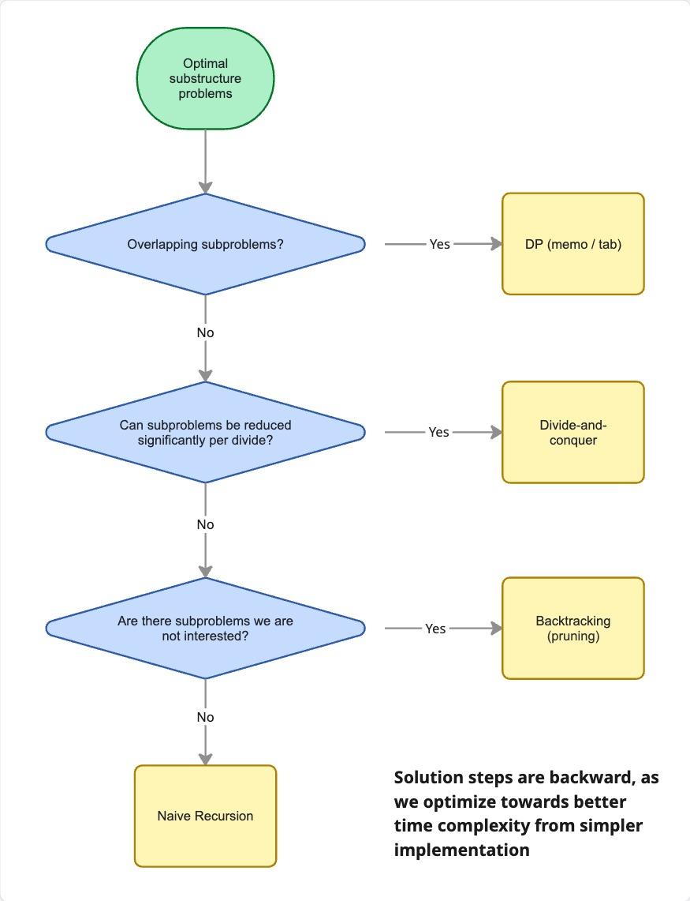

# Optimal Substructure

A problem has Optimal Substructure when its solution can be expressed in terms of solutions to smaller instances of the same problem.
This property is the foundation of algorithm design techniques covered in next chapters.



## Recursion

Recursion is often the most natural implementation of Optimal Substructure problems.

Every recursive function follows two rules:
1. Base case: The condition under which the function returns a direct answer without recursing further.
2. Recursive case: The condition under which the function calls itself with a strictly smaller (or simpler) input.

Recurrance Relation problems, most popularly the 'nth Fibonacci number' calculation best represents the use of pure naive recursion.
Optmization techniques like Dynamic Programming will be discussed in later chapters.

```python
...

def fibonacci(n: int) -> int:
    """
    TC: O(2^N)
    SC: O(N)

    Constraint: 0 <= n <= 45
    """

    # Base case
    if n <= 1:
        return n

    # Branching factor is 2, so is time complexity if 2^N
    return fibonacci(n - 1) + fibonacci(n - 2)
```

Some tips for recursion:
- Always define the base case before writing the recursive case.
  A missing or incorrect base case causes infinite recursion (stack overflow).
- Drawing the call tree makes the structure of a recursion visible and reveals whether further optimizations can be made (overlap subproblems, branch pruning etc).
- Recursive solutions carry an implicit space cost from the call stack, even when no auxiliary data structures are used.
- If the problem needs multiple state management throughout each subproblem, Recursion should be the first choice on the toolbelt since it makes code much simpler.
  If not, iterative approach is better. 
  This will be discussed as main dish later in Dynamic Programmin chapter.
  - [LeetCode 206. Reverse Linked List](https://leetcode.com/problems/reverse-linked-list)