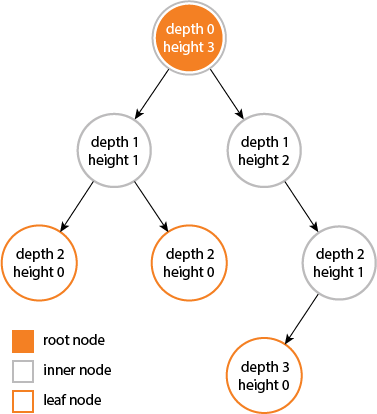
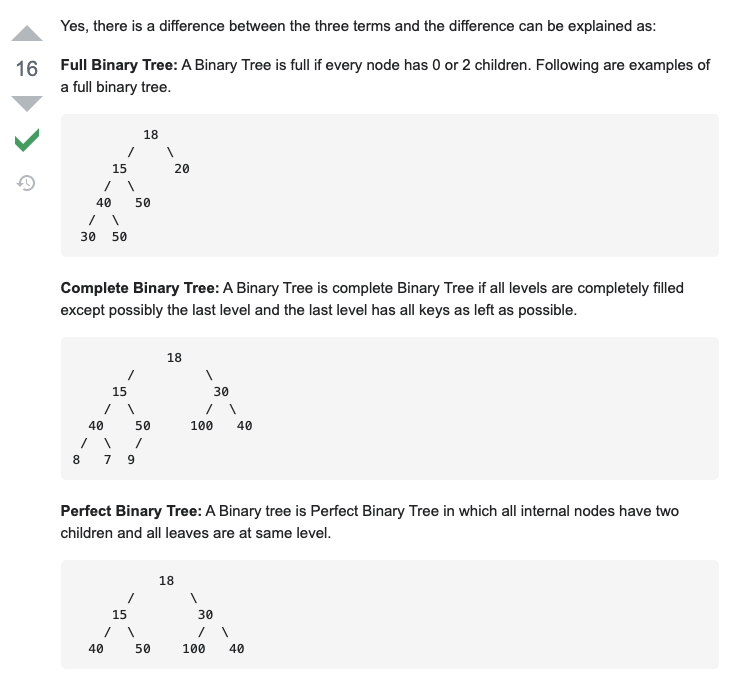

# Binary Tree

- Root Node:
  Node that is on the first level of the Binary Tree.
- Leaf Node:
  Nodes that do not have any children.
- Depth and Height:
  Height starts from leaf node, Depth starts from root node, thus height of a tree == maximum depth of subtree.

  

  - [LeetCode 110. Balanced Binary Tree](https://leetcode.com/problems/balanced-binary-tree)
- Various types of binary trees.

  

  Heap and Binary Search Tree are complete binary trees.
  Perfect Binary Tree contains `2^(h + 1) - 1` nodes and `2^h` leaf nodes.

Binary Trees are another type of Optimal Substructure problem where subproblems are subtrees of the original Binary Tree.
Traversing it is how you approach the subtrees (subproblems).

## Traversal

Almost all Binary Tree problems are given a root node that represents the tree, and require various traversals.

```python
...

from __future__ import annotations
from typing import Any, List, Optional
from collections import deque


"""
N = number of Nodes in tree

TC: O(N)
SC: O(logN)
"""

class TreeNode:
    def __init__(self, val: Any, left: Optional[TreeNode], right: Optional[TreeNode]):
        self.val = val
        self.left = left
        self.right = right


def inorder_recursive(rt: TreeNode) -> List[Any]:
    res = list()

    def rec(_rt: TreeNode):
        if rt is None:
            return

        rec(_rt.left)
        res.append(_rt)
        rec(_rt.right)

    rec(rt)
    return res


def inorder_iterative(rt: TreeNode) -> List[Any]:
    res = list()
    stk = deque()
    cur = rt
    while stk or cur:
        while cur:
            stk.append(cur)
            cur = cur.left
        cur = stk.pop()
        res.append(cur)
        cur = cur.right
    return res


def preorder_recursive(rt: TreeNode) -> List[Any]:
    res = list()

    def rec(_rt: TreeNode):
        if _rt is None:
            return

        res.append(_rt)
        rec(_rt.left)
        rec(_rt.right)

    rec(rt)
    return res


def preorder_iterative(rt: TreeNode) -> List[Any]:
    if rt is None:
        return list()

    res = list()
    stk = deque()
    stk.append(rt)
    while stk:
        cur = stk.pop()
        res.append(cur.val)

        # Push right first so that left is processed first
        if cur.right:
            stk.append(cur.right)
        if cur.left:
            stk.append(cur.left)
    return res


def postorder_recursive(rt: TreeNode) -> List[Any]:
    res = list()

    def rec(_rt: TreeNode):
        if rt is None:
            return

        rec(_rt.left)
        rec(_rt.right)
        res.append(_rt)

    rec(rt)
    return res


def postorder_iterative(rt: TreeNode) -> List[Any]:
    if rt is None:
        return list()

    res = list()
    stk = deque()
    cur = rt
    last = None
    while stk or cur:
        if cur:
            stk.append(cur)
            cur = cur.left
        else:
            peeked = stk[-1]
            if peeked.right and last != peeked.right:
                cur = peeked.right
            else:
                res.append(peeked)
                last = stk.pop()
    return res


def levelorder(rt: TreeNode) -> List[Any]:
    res = list()
    que = deque()
    que.append(rt)
    while que:
        size = len(que)
        while size > 0:
            polled = que.popleft()
            res.append(polled)
            if polled.left:
                que.append(polled.left)
            if polled.right:
                que.append(polled.right)
            size -= 1
    return res
```

Problems often require you to construct / reconstruct a Binary Tree.
- [LeetCode 108. Convert Sorted Array to Binary Search Tree](https://leetcode.com/problems/convert-sorted-array-to-binary-search-tree) (Divide and Conquer)
- [LeetCode 226. Invert Binary Tree](https://leetcode.com/problems/invert-binary-tree)

In-order with either Pre-order or Post-order traversal, a unique Binary Tree can be constructed from a sorted List (Divide and Conquer).
- [LeetCode 105. Construct Binary Tree from Preorder and Inorder Traversal](https://leetcode.com/problems/construct-binary-tree-from-preorder-and-inorder-traversal)

However, In-order alone or pre-order with post-order traversal cannot construct a unique Binary Tree (Divide and Conquer).

- [LeetCode 889. Construct Binary Tree from Preorder and Postorder traversal](https://leetcode.com/problems/construct-binary-tree-from-preorder-and-postorder-traversal)

With the help of 'null' nodes marked as special characters, serialized representation of a Binary Tree can be derived from Pre-order or Post-order traversal.
- [LeetCode 572. Subtree of Another Tree](https://leetcode.com/problems/subtree-of-another-tree)
- [LeetCode 652. Find Duplicate Subtrees](https://leetcode.com/problems/find-duplicate-subtrees)

There is an In-order traversal algorithm called [Morris Inorder Traversal](https://www.youtube.com/watch?v=wGXB9OWhPTg) that uses O(1) space by using iteration without recursion or a stack.
